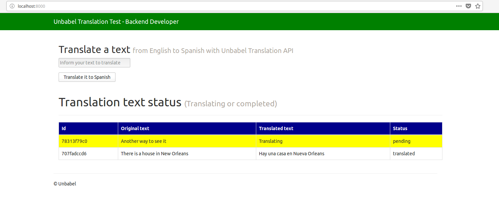

# Unbabel Translate API Test 
> Flask APP to translate a text in English language to Spanish using the Unbabel API
consuming it and insert in a database using also a celery background task. 

### Task Description

## Unbabel Fullstack Challenge
Hey :)
Welcome to our Fullstack Challenge repository. This README will guide you on how to participate in this challenge.
In case you are doing this to apply for our open positions for a Fullstack Developer make sure you first check the available jobs at https://unbabel.com/jobs
Please fork this repo before you start working on the challenge. We will evaluate the code on the fork.
FYI: Please understand that this challenge is not decisive if you are applying to work at Unbabel. There are no right and wrong answers. This is just an opportunity for us both to work together and get to know each other in a more technical way.

### Challenge
We're going to build a very simple translation web app based on the Unbabel API.
You can find more info about the api at https://developers.unbabel.com

Request an API Key to your hiring manager or point of contact for the hiring process at Unbabel so you can use the API for this tutorial.
Build a basic web app with a simple input field that takes an English (EN) input translates it to Spanish (ES).
When a new translation is requested it should add to a list below the input field (showing one of three status: requested, pending or translated) - (note: always request human translation)
The list should be dynamically ordered by the size of the translated messages


### Requirements

Use Flask web framework
Use Bootstrap
Use PostgreSQL
Create a scalable application.
Only use Unbabel's Translation API on sandbox mode
Have tests


### Notes

Page load time shouldnt exceed 1 second


### Resources

Unbabel's API: http://developers.unbabel.com/

## Technologies utilized
* Python 3.6+
* Flask 1.0.2
* PostgreSQL 10+

### Test Environment

### Installation

Any Operating System with docker/docker-compose installed:

```
a) git clone https://github.com/diemesleno/unbabel.git

b) cd unbabel

c) ./run.sh
```

## Some screenshots

### Main Page



## Release History
* 1.0.0
    * First release
* 0.1.1
    * Fixing issues
* 0.1.0
    * Testing deployment
* 0.0.9
    * Creation of Dockerfiles
* 0.0.8
    * Preparing files to production
* 0.0.7
    * Development of Tests
* 0.0.6
    * Development of  Blueprints
* 0.0.5
    * Development of  cli app
* 0.0.4 
    * Development of configurations
* 0.0.3
    * Development of views Views
* 0.0.2
    * Development of project Models
* 0.0.1
    * Project Unbabel creation

## Meta

Diemesleno Souza Carvalho – [@diemesleno](https://twitter.com/diemesleno) – diemesleno@gmail.com


[https://github.com/diemesleno/unbabel](https://github.com/diemesleno/)